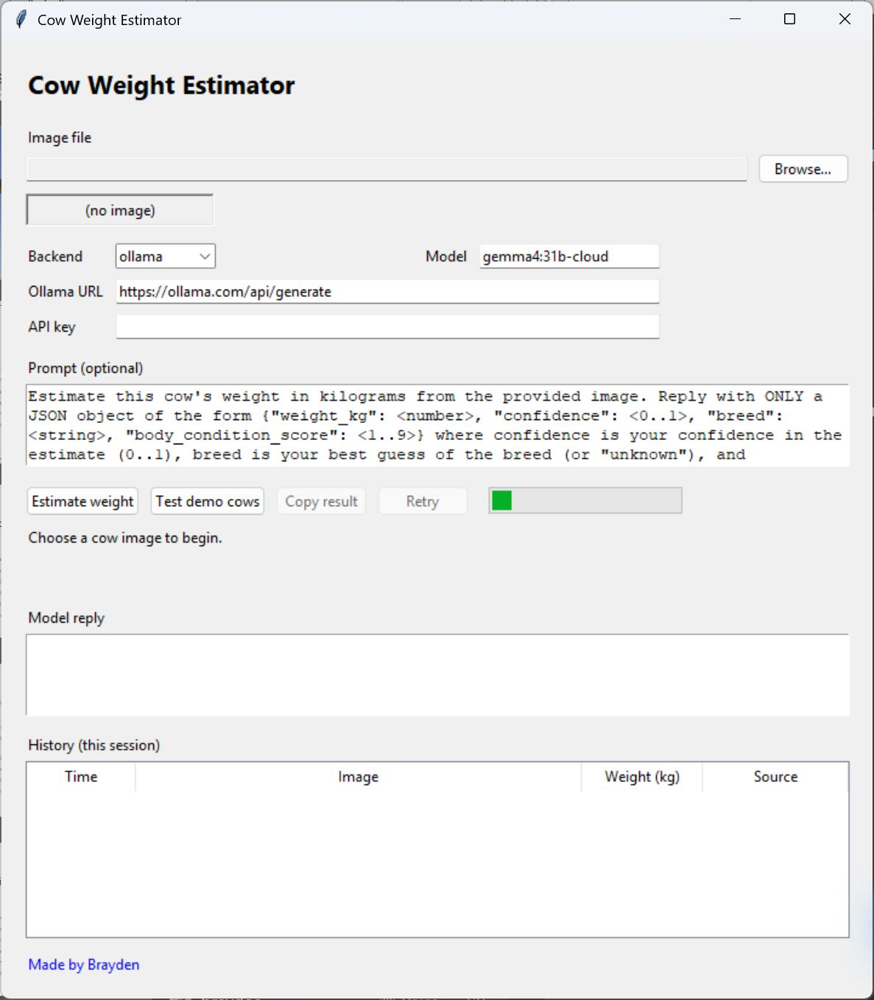
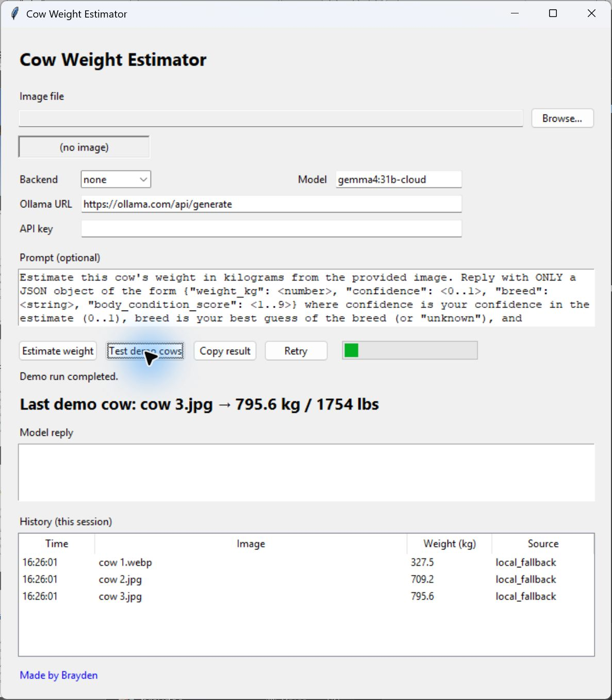
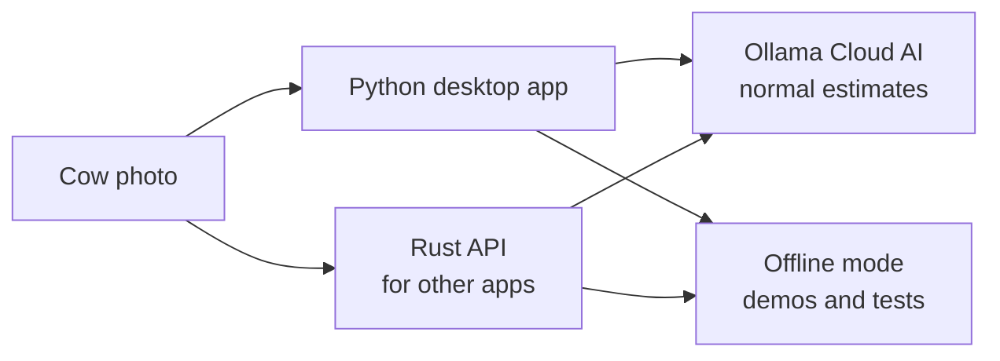

# Cow Weight Estimator

Turn a photo of a cow into a **rough weight estimate**. This project has a friendly Windows app for people and a fast web API for other programs.

> **A quick note on accuracy:** this is an AI estimate, not a replacement for a scale, veterinary advice, or an official livestock record.



## Start here

If you just want to try it, double-click `start_gui.bat`. Pick a cow photo, then select **Estimate weight**. You do not need to run a server or understand the code to use the desktop app.

```powershell
python gui.py
```



The **Test demo cows** button runs three included photos. In the screenshot it is set to `none`, the offline practice mode: it does not use the internet or an AI service.

## What happens when you press the button?

1. You choose a photo of a cow.
2. The app checks that it really looks like an image file.
3. With the normal **Ollama** setting, the photo and a short question go to an AI vision model.
4. The app reads the model's answer and shows kilograms and pounds, plus any confidence or breed details it received.

For practice, testing, or no-internet situations, choose `none`. It produces a repeatable placeholder result from the file data; it is useful for checking the app works, but it is **not** a real cow-weight prediction.

## Why these tools?

| Tool | Plain-English job | Why it is a good fit |
| --- | --- | --- |
| **Ollama Cloud** | The optional AI service that looks at the cow photo. | It lets the project use a capable vision model without downloading a huge model to every computer. It can be a cost-conscious choice for small projects because you only make requests when you estimate a photo; check Ollama's current pricing before using it at scale. |
| **Python + Tkinter** | The simple, click-and-use desktop window. | Python is easy to read and Tkinter is included with normal Python on Windows, so the GUI stays small and does not need a pile of extra downloads. |
| **Rust** | The optional web/API service for websites and other software. | Rust is compiled and fast, so it is a strong fit for a backend that can handle several requests without one slow AI response freezing everybody else. |
| **`none` mode** | An offline demo and test mode. | It avoids network costs and makes tests give the same result every time. |

## The code, in normal words

You do not need to read every file. The folders below are the main moving parts.



| If you want to understand or change… | Look here | What it does |
| --- | --- | --- |
| The window people click | [`aif/gui.py`](aif/gui.py) | Creates the buttons, image picker, result area, and history list. |
| The AI question and result reading | [`aif/estimator.py`](aif/estimator.py) | Sends an image to Ollama, reads the answer, and checks images are valid. |
| Settings such as the model name or API key | [`aif/config.py`](aif/config.py) and [`.env.example`](.env.example) | Holds safe defaults and reads your local `.env` settings file. |
| The fast web service | [`backend/src/http.rs`](backend/src/http.rs) | Receives requests from other software and returns an estimate as JSON. |
| The Rust server's supporting jobs | [`backend/src/`](backend/src/) | `validate.rs` checks images, `parse.rs` reads AI answers, `ollama.rs` talks to Ollama, `cache.rs` remembers repeat requests, and `fallback.rs` powers offline mode. |
| Starting the API | [`app.py`](app.py) | Finds and starts the Rust backend. |
| Starting the desktop app | [`gui.py`](gui.py) or [`start_gui.bat`](start_gui.bat) | Opens the friendly Python window. |
| Making sure it keeps working | [`tests/`](tests/) | Tests the GUI, Python logic, and the real Rust API. |

## Want to use the API instead?

The API is for a website, mobile app, or another program—not needed for the desktop app. Build and start it like this:

```powershell
cargo build --release --manifest-path backend/Cargo.toml
python app.py
```

It listens at `http://127.0.0.1:8080`. The detailed endpoints are below in the [API reference](#api-reference).

## Before using Ollama

Ollama is the normal AI option. Create an API key at <https://ollama.com/settings/keys>, copy `.env.example` to `.env`, then add your key:

```ini
OLLAMA_API_KEY=your-key-here
```

Keep that key private: `.env` is ignored by Git and should never be uploaded. For the full list of settings, see [Configuration](#configuration).

---

## Technical reference

### Requirements

- **Python 3.8+** for the desktop app. It uses Tkinter, which comes with normal Windows Python installs; no `pip install` is required.
- **Rust** only if you want to run the optional API server. Install it through [rustup](https://rustup.rs/).
- An **Ollama API key** only for real AI estimates. The offline `none` mode needs neither an account nor an internet connection.

### Desktop app details

```powershell
python gui.py
```

Pick a cow image, tweak the prompt if you like, pick a backend and model,
and select **Estimate weight** (or press `Enter`). The estimate runs on a
background thread so the window stays responsive; a progress bar indicates
activity. The result, the model's full reply, and a session-only history of
the last 20 estimates are shown in the window. A **Copy result** button
puts the weight on the clipboard. No command window, no separate server to
keep running. The GUI calls the estimator directly.

### HTTP API server

Build the Rust backend, then start it:

```powershell
cargo build --release --manifest-path backend/Cargo.toml
python app.py
```

`python app.py` launches the compiled `aif-backend` binary (override the
path with the `AIF_BACKEND_BIN` env var) and the API listens on
`http://127.0.0.1:8080`. See [API reference](#api-reference).

---

## API reference

### `GET /health`

Liveness probe.

```json
{ "status": "ok", "backend": "ollama", "model": "gemma4:31b-cloud", "request_id": "bce5028c" }
```

### `GET /`

Service info; name, version, and the list of endpoints.

```json
{
  "name": "Cow Weight Estimator",
  "version": "0.1.0",
  "endpoints": ["POST /estimate-weight", "GET /health", "GET /"],
  "request_id": "bce5028c"
}
```

### `OPTIONS /estimate-weight` (and any path)

CORS preflight. Returns `204 No Content` with
`Access-Control-Allow-Origin: *`, `Access-Control-Allow-Methods: POST, GET, OPTIONS`,
and `Access-Control-Allow-Headers: Content-Type`.

### `POST /estimate-weight`

Estimate a cow's weight from an image. Send **either** `image_url` **or**
`image_base64`; `prompt` is optional and defaults to a sensible built-in
prompt.

#### Request body

| Field          | Type   | Required                  | Description                                                                            |
| -------------- | ------ | ------------------------- | -------------------------------------------------------------------------------------- |
| `image_url`    | string | one of `image_*` required | URL the server will fetch (HTTPS or HTTP) and encode.                                  |
| `image_base64` | string | one of `image_*` required | Raw base64 image bytes, or a `data:<mime>;base64,...` URI.                              |
| `prompt`       | string | no                        | Override the estimation prompt. Defaults to `DEFAULT_PROMPT`. |

#### Example: URL

```bash
curl -s http://127.0.0.1:8080/estimate-weight \
  -H "Content-Type: application/json" \
  -d "{\"image_url\": \"https://example.com/cow.jpg\", \"prompt\": \"Estimate this cow's weight in kg.\"}"
```

```json
{
  "estimated_weight_kg": 612.0,
  "estimated_weight_lbs": 1349.2,
  "source": "ollama",
  "model": "gemma4:31b-cloud",
  "prompt_used": "Estimate this cow's weight in kg.",
  "model_response": "{\"weight_kg\": 612, \"confidence\": 0.82, \"breed\": \"Angus\", \"body_condition_score\": 6}",
  "confidence": 0.82,
  "breed": "Angus",
  "body_condition_score": 6.0,
  "request_id": "bce5028c"
}
```

#### Example: base64

```json
{
  "image_base64": "iVBORw0KGgoAAAANSUhEUgAA..."
}
```

#### Response

| Field                  | Type    | Always present | Description                                                              |
| ---------------------- | ------- | -------------- | ------------------------------------------------------------------------ |
| `estimated_weight_kg`  | number  | yes            | The estimated weight in kilograms.                                       |
| `estimated_weight_lbs` | number  | yes            | The estimated weight in pounds (`kg * 2.20462`, rounded to 1 dp).        |
| `source`               | string  | yes            | `ollama` or `local_fallback`.                                            |
| `model`                | string  | ollama only    | The model name used.                                                     |
| `prompt_used`          | string  | yes            | The prompt actually sent (useful when the default was applied).          |
| `model_response`       | string  | yes            | Raw model text (empty string for the local fallback).                    |
| `confidence`           | number  | ollama, JSON   | Model's confidence in the estimate (0..1). Present when the model returns the structured JSON. |
| `breed`                | string  | ollama, JSON   | Model's breed guess. Present when the model returns the structured JSON. |
| `body_condition_score` | number  | ollama, JSON   | 1-9 body condition score. Present when the model returns the structured JSON. |
| `request_id`           | string  | yes            | 8-char hex id, also sent in the `x-request-id` response header.          |

Every response (success or error) also includes the
`Access-Control-Allow-Origin: *` CORS header.

#### Status codes

| Status | Meaning                                                              |
| ------ | -------------------------------------------------------------------- |
| `200`  | Success.                                                             |
| `400`  | Bad request. Missing image, invalid JSON, no body, or non-image bytes (`invalid_image`). |
| `404`  | Unknown path.                                                        |
| `502`  | Estimator failure. Backend unreachable, no key, or unparseable reply. |

Every error response includes a machine-readable `code` field alongside
the human `error` message: `missing_body`, `invalid_json`,
`missing_image`, `invalid_image`, `not_found`, or `estimation_failed`.
Every error response also includes the `request_id` (matching the
`x-request-id` header). Any other path returns `404`.

---

## Configuration

All settings are read from environment variables, with `.env` used as a
fallback at startup (both the Python package and the Rust binary use the
same rules: values already in the environment take precedence over `.env`).
The server reads config once at startup, so changes after it has started
have no effect. Restart to pick up new config.

| Variable          | Default                           | Used by          | Description                                                     |
| ----------------- | --------------------------------- | ---------------- | --------------------------------------------------------------- |
| `AIF_AI_BACKEND`  | `ollama`                          | both             | `ollama` (Ollama Cloud) or `none` (deterministic local fallback). |
| `AIF_OLLAMA_URL`  | `https://ollama.com/api/generate` | both             | Ollama Cloud generate endpoint.                               |
| `AIF_AI_MODEL`    | `gemma4:31b-cloud`                | both             | Model name sent in the request.                               |
| `OLLAMA_API_KEY`  | _(none)_                          | both (cloud)     | Bearer token. Required when `AIF_OLLAMA_URL` points at `ollama.com`. |
| `AIF_CACHE_TTL`   | `300`                             | server + GUI     | In-memory cache TTL in seconds. `0` disables caching.         |

### Setting up Ollama Cloud

1. Create an API key at <https://ollama.com/settings/keys>.
2. Put it in `.env` (or export it in your shell):

   ```ini
   OLLAMA_API_KEY=your-key-here
   ```

3. Ensure `AIF_AI_BACKEND=ollama` (it's the default).

The default model is `gemma4:31b-cloud`, the direct-cloud API name. The
`gemma4:31b` tag is a 20GB local-runtime download and will not work against
the cloud endpoint; use `gemma4:31b-cloud` for this service.

> Do not commit a real API key. `.env` is gitignored; a sanitized
> `.env.example` is committed as a template. Copy it to `.env` and fill in
> your key.

### Offline / no-network mode

Set `AIF_AI_BACKEND=none` for a deterministic, SHA-256-derived estimate in
the range 250-900 kg. Stable for a given input; useful for tests, demos,
and air-gapped environments. Reports `source == "local_fallback"`.

---

## Testing

```powershell
cargo test --manifest-path backend/Cargo.toml
python -m unittest discover -s tests -v
```

The Python suite spawns the compiled Rust binary, so build the release
binary first.

- Rust unit tests live next to each module in `backend/src/`: config
  parsing, base64/magic-byte validation, structured/text weight parsing,
  fallback determinism, cache hit/disabled/expiry, and retry details.
- `tests/test_server.py` spawns the real binary on a free port and
  exercises it over real sockets, validating status codes, JSON
  serialization, CORS headers, request IDs, error codes, and concurrent
  requests. The HTTP tests force `backend="none"` to stay deterministic.
  A 502 test forces `backend="ollama"` with no key and asserts
  `code == "estimation_failed"`; a 400 test forces `backend="ollama"` with
  a key but non-image bytes and asserts `code == "invalid_image"`.
- `OllamaEstimatorTests` covers the Python estimator's weight extraction,
  data-URI stripping, image magic-byte validation, backend selection, and
  bearer-token auth via `unittest.mock`. `StructuredResponseTests` covers
  the JSON-vs-text parsing path. `CacheTests` covers cache hit / disabled /
  expiry. `RetryTests` covers the retry-once-on-transient-failure policy.
  The live Ollama network path is not exercised.
- `GuiSmokeTests` builds the Tk root + `CowWeightApp` and destroys it,
  catching import/layout regressions in `aif/gui.py`.

Run a single test:

```powershell
python -m unittest tests.test_estimator.OllamaEstimatorTests.test_cloud_endpoint_uses_bearer_token -v
```

Lint with ruff (configured in `pyproject.toml`):

```powershell
ruff check .
ruff check --fix .
```

---

## Project structure

```
.
├── backend/                     # The Rust HTTP API (crate aif-backend)
│   ├── Cargo.toml               # 3 deps: ureq (rustls), serde_json, sha2
│   └── src/
│       ├── config.rs            # .env loader, defaults, env-var precedence
│       ├── validate.rs          # base64 decoding + image magic-byte validation
│       ├── parse.rs             # JSON-first / free-text weight extraction
│       ├── fallback.rs          # deterministic SHA-256-derived estimate
│       ├── cache.rs             # in-memory TTL result cache
│       ├── ollama.rs            # Ollama Cloud client (auth, retry policy)
│       ├── http.rs              # threaded HTTP/1.1 server (all routes)
│       ├── lib.rs               # module wiring
│       └── main.rs              # entry point (--host / --port flags)
├── aif/                         # The Python package (GUI + estimator)
│   ├── __init__.py              # Package exports (estimator, constants)
│   ├── config.py                # Constants, defaults, .env loader
│   ├── estimator.py             # CowWeightEstimator (GUI only)
│   └── gui.py                   # Tkinter desktop app, reuses aif.estimator
├── app.py                       # Launcher: python app.py spawns the Rust API
├── gui.py                       # Thin wrapper: python gui.py runs the GUI
├── start_gui.bat                # Double-click launcher (pythonw, no console window)
├── start_gui.ps1                # PowerShell equivalent of start_gui.bat
├── install.ps1                  # Bootstrap: installs Python/Rust, builds, creates shortcut
├── build_exe.bat                # Local one-file exe build (Rust + PyInstaller)
├── CowWeightEstimator.spec      # PyInstaller spec (bundles cows/ + Rust binary)
├── pyproject.toml               # Python metadata + ruff config
├── CONTRIBUTING.md              # Conventions + step-by-step guides for changes
├── .env.example               # Template for local config (committed)
├── .env                        # Local config (gitignored, not committed)
├── cows/                        # Demo images for the GUI's "Test demo cows" button
├── tests/
│   ├── test_server.py           # HTTP suite against the Rust binary (real sockets)
│   ├── test_estimator.py        # Python estimator unit tests
│   ├── test_config.py           # .env / repo-root resolution tests
│   └── test_gui.py              # GUI smoke tests
└── .github/workflows/
    └── build-windows.yml        # Release build: Rust binary + PyInstaller .exe
```

## Architecture

Two layers:

- **Rust `aif-backend`** (`backend/`) — the HTTP API. A hand-rolled
  HTTP/1.1 server on `std::net::TcpListener` with one thread per
  connection, so slow Ollama requests never block each other (the old
  Python `http.server` was single-threaded). Valid routes: `POST
  /estimate-weight`, `GET /health`, `GET /` or `/info`, `OPTIONS`; anything
  else returns `404`. Requests are read as a single Content-Length-delimited
  body (no keep-alive, no chunked encoding; intentional). The Ollama client
  (`ureq` + rustls) retries once on transient failures; results are cached
  in a TTL cache. `app.py` locates and spawns the binary (`AIF_BACKEND_BIN`
  overrides the path); `--port 0` prints the bound port (the test suite
  relies on this).
- **`CowWeightEstimator`** (`aif/estimator.py`) — the GUI's estimation
  logic, decoupled from HTTP. `estimate()` dispatches on the configured
  backend and returns the same dict shape the Rust server produces. The
  Rust and Python implementations of shared logic (fallback math, weight
  extraction, image validation, cache keying) must stay behaviorally
  identical.
- **`CowWeightApp`** (`aif/gui.py`) — the Tkinter desktop app.

The GUI does not start the HTTP server. It instantiates
`CowWeightEstimator` directly (with the backend/model/URL/API key selected
in the UI) and runs the call on a background thread so the Tk event loop
never blocks. Image preview uses Pillow if importable, otherwise degrades
to showing the filename and byte size. Keyboard: `Enter` estimates (in the
prompt box, use `Ctrl+Enter` to keep newlines free). A session-only history
panel keeps the last 20 estimates.

---

## Releases (Windows)

Publishing a GitHub release triggers `.github/workflows/build-windows.yml`,
which runs `cargo test` and the Python suite on `windows-latest`, builds
the Rust backend, packages the GUI into a one-file windowed
`CowWeightEstimator.exe` with PyInstaller, and attaches **both**
executables to the release and the workflow artifact. Download and run
directly; no Python or Rust installation needed on the target machine.

To build locally instead, run `build_exe.bat` (or
`build_exe.bat clean`); it builds the Rust binary when cargo is available,
installs PyInstaller if missing, and runs the spec file.

---

## Notes

- The server reads config at startup (Python at import time, Rust at
  launch). To change backends or keys, edit `.env` (or env vars) and
  restart the server/GUI.
- WebP uploads on Windows work even when the OS reports the image as
  `application/octet-stream`; any `data:<mime>;base64,` prefix is stripped.
- Image bytes are validated against JPEG/PNG/GIF/BMP/WebP magic bytes
  before being sent to the model; non-images are rejected with
  `400 invalid_image`.
- Weight is extracted from model output by first looking for a JSON object
  with a `weight_kg` field (the default prompt asks for this), and falling
  back to an explicit `<number> kg` (case-insensitive), then the first bare
  number.
- The in-memory cache is per-process. The HTTP server uses one long-lived
  cache, so repeat requests for the same image hit it; the GUI builds a
  fresh estimator per request, so it does not share the cache. Set
  `AIF_CACHE_TTL=0` to disable caching.
- Transient Ollama failures (5xx, network/timeout errors) are retried once
  after a 1 s backoff; 4xx errors and unparseable responses are not
  retried.
- Every response includes a `request_id` (8-char hex) in the JSON body and
  the `x-request-id` header; the server tags stderr logs with it.
